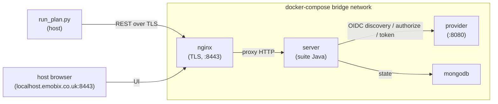

# OIDC Conformance Suite harness

Runs the [OpenID Foundation Conformance Suite][suite] against the
provider, end-to-end, in three Docker containers (MongoDB + Java
suite + our provider).

[suite]: https://gitlab.com/openid/conformance-suite

## What this is for

`tests/test_conformance.py` and `tests/test_integration_mock_rp.py`
are our own regression tests; they catch the bugs *we know about*.
The conformance suite catches the bugs *the spec writers know about*
— corner cases of OIDC Core 1.0, RFC 6749, RFC 7009, RFC 7636, etc.,
that an in-tree test wouldn't think to check. Run it before tagging
a release and after any change to the protocol surface.

## Prerequisites

- Docker 24+ (uses Compose V2 — `docker compose`, not `docker-compose`)
- ~2 GB free disk for the suite + MongoDB images (pulled from
  `registry.gitlab.com/openid/conformance-suite{,/nginx}`; pinned to
  release-v5.1.43 by default)
- Ports 8443 (suite) and 8080 (provider) free on the host
- `/etc/hosts` entry `127.0.0.1 localhost.emobix.co.uk` (the public
  DNS record points there too, so this is usually only needed when
  your network resolver blocks the lookup)

## One-shot run

```sh
uv run nox -s conformance
```

The session:

1. `docker compose -f tests/conformance/docker-compose.yml up -d --wait`
   — brings up all three services and blocks on health checks.
2. `python tests/conformance/run_plan.py` — submits the full
   `oidcc-basic-certification-test-plan` (~80 modules), polls each,
   exits non-zero if any FAIL.
3. `docker compose down` — tears the stack down.

A complete run takes 10–15 minutes on a developer laptop.

## Manual / iterative use

When iterating on a specific module, drive the suite from its UI:

```sh
docker compose -f tests/conformance/docker-compose.yml up -d --wait
open https://localhost.emobix.co.uk:8443
```

The browser will warn about a self-signed cert; that's expected. The
suite UI lets you create plans, run individual modules, and inspect
trace logs.

## Run a different plan

```sh
# Smoke run (fewer modules, ~2 minutes):
uv run python tests/conformance/run_plan.py --plan oidcc-test-plan

# Other certification plans (query the suite for the full list):
curl -ks https://localhost.emobix.co.uk:8443/api/plan/available \
  | python -c "import json,sys; [print(p['planName']) for p in json.load(sys.stdin) if p['planName'].startswith('oidcc-')]"
```

Use `--strict-warnings` to fail the run on WARNING-level results
(e.g. when preparing a certification submission).

## Run only specific modules

Some plans (notably `oidcc-basic-certification-test-plan`) drive a
bundled HtmlUnit 4.11.1 instance that hits a `NullPointerException:
engine is null` in the async XMLHttpRequest path. Roughly half of the
browser-driven modules can TIMEOUT for that reason — see the
`Dockerfile.suite` comment for the full context. To run only the
modules that complete reliably, pass `--include`:

```sh
uv run nox -s conformance -- \
  --plan oidcc-basic-certification-test-plan \
  --include \
    oidcc-server \
    oidcc-userinfo-get \
    oidcc-userinfo-post-header \
    oidcc-userinfo-post-body \
    oidcc-ensure-request-without-nonce-succeeds-for-code-flow \
    oidcc-response-type-missing
```

The summary distinguishes `FILTERED` modules from real outcomes, and
filtered modules do not influence the exit code — they were never
sent to the suite. Use `--exclude MODULE [MODULE ...]` to drop a
single known-broken module while still running the rest. If you mix
`--include` with `--exclude`, the include allow-list is applied
first, then the exclude denylist.

A typo in `--include` (a name no module in the plan carries) is
logged as `WARNING --include names not present in plan (typo?): …`
so an empty run does not silently masquerade as success.

`--include` and `--exclude` both accept `fnmatch` glob patterns:

```sh
# Skip every userinfo-* module (HtmlUnit hangs after the first
# browser-driven module, this excludes the visibly-affected family):
uv run nox -s conformance -- \
  --plan oidcc-basic-certification-test-plan \
  --exclude 'oidcc-userinfo-*'

# Run only the id_token negative tests:
uv run nox -s conformance -- \
  --plan oidcc-basic-certification-test-plan \
  --include 'oidcc-id-token-*'
```

A pattern without glob metacharacters degrades to exact equality, so
plain names keep working unchanged.

## Archive results to HTML

After a discovery run it's often useful to keep the suite's full
event log per module — for review, attaching to a certification
submission, or comparing against the next run. Pass `--export-dir`:

```sh
uv run nox -s conformance -- \
  --plan oidcc-basic-certification-test-plan \
  --export-dir tests/conformance/reports
```

The runner downloads `GET /api/plan/exporthtml/{plan_id}` and writes
a zip archive `reports/{plan_id}.zip` containing one HTML file per
module. Mirrors the upstream `conformance.py:exporthtml()` pattern.

## Expected failures (XFAIL / XPASS)

For long-lived green CI you want known-broken modules acknowledged
without polluting the run with red. Pass `--expected-failures
FILE.json`:

```json
{
  "oidcc-userinfo-get": "HtmlUnit 4.11.1 NPE in async XHR (upstream)",
  "oidcc-userinfo-post-header": "HtmlUnit 4.11.1 NPE in async XHR (upstream)",
  "oidcc-prompt-login": "OIDC prompt= parameter not yet implemented",
  "oidcc-id-token-hint": "id_token_hint not yet implemented"
}
```

A FAILED/TIMEOUT/ERROR module listed there is re-bucketed as `XFAIL`
and does NOT influence the exit code. A PASSED module listed there
triggers an `XPASS` alarm — that means the entry is stale (the
upstream issue was likely fixed) and should be edited out. Mirrors
the upstream `run-test-plan.py --expected-failures-file` pattern.

## Per-module restart loop

The HtmlUnit one-shot bug means a single shared-stack run cannot
honestly distinguish "real spec failure" from "HtmlUnit gave up".
For a clean `PASSED` / `FAILED` partition use the per-module
orchestrator, which tears the suite stack down between every module
so each one gets a fresh JVM:

```sh
tests/conformance/run_per_module.sh \
  --plan oidcc-basic-certification-test-plan \
  --results-dir tests/conformance/results \
  -- --exclude 'oidcc-userinfo-*'
```

How it works:

1. Brings the stack up once and calls `run_plan.py --list-modules`
   to enumerate the plan; tears down.
2. For each module: `compose up` → `run_plan.py --include MODULE
   --summary-json results/MODULE.json` → `compose down -v`.
3. Runs `aggregate_summaries.py results/` to produce the combined
   summary in the same format `emit_summary` prints for a single
   run.

Anything after `--` is forwarded verbatim to `run_plan.py`, so
filters, `--strict-warnings`, `--expected-failures` and the like all
work the same way.

**Cost**: ~30s of compose lifecycle × N modules. For the basic-cert
plan (~35 modules) the run is ~70-80 minutes versus ~30-50 minutes
for shared-stack. Use this only when you need a clean partition;
day-to-day iteration should stay on `nox -s conformance`.

## Baseline expected_failures.json

`tests/conformance/expected_failures.json` records the known status
of every basic-cert module that does NOT pass cleanly today, with
short reasons grouped into three classes:

1. **Real provider gaps** (~3 modules) — features we have not yet
   implemented (`prompt=`, `id_token_hint`). Each is a roadmap
   entry; remove the line when you implement the feature and the
   next run will produce an `XPASS` alarm to confirm.
2. **HtmlUnit upstream issues** (~16 modules) — TIMEOUT in the
   suite-side browser even with per-module restart. These come back
   only when the suite ships a newer HtmlUnit (4.13+).
3. **Suite-side SKIP** (3 modules) — `oidcc-scope-{address,phone,all}`
   the suite skips because we do not advertise these scopes in
   discovery. Listed so they don't tilt the exit code.

`run_per_module.sh` automatically passes
`--expected-failures tests/conformance/expected_failures.json` if
the file exists and the operator did not override it. With the
baseline in place, a default per-module run prints `xfail=N
xpass=0` and exits 0 — green CI baseline, while any `XPASS` line is
a loud alarm that an entry has gone stale and should be removed.

## Discovery: which modules pass on this machine?

The HtmlUnit NPE is non-deterministic, and a failed module can
poison the browser state of subsequent modules in the same plan.
For a clean PASS/FAIL split, run with `--isolated` — each module
gets a fresh plan instance, so cross-contamination is impossible:

```sh
uv run nox -s conformance -- \
  --plan oidcc-basic-certification-test-plan \
  --isolated
```

Cost: ~1-2 seconds of plan-creation overhead per module, negligible
on a ~30-minute basic-cert run. After a mixed run (some PASS, some
FAIL), the summary prints copy-pasteable groups:

```
=== Module groups ===
# Allowlist (PASSED + WARNING) — paste into --include:
oidcc-server
oidcc-userinfo-get
…

# Denylist (FAILED + TIMEOUT) — paste into --exclude:
oidcc-id-token-bad-sig
…
```

The next run can be locked to the discovered allowlist with
`--include …` (no `--isolated` needed once the set is stable).

## Configuration

`run_plan.py` reads from environment variables that are pre-set by
docker-compose; override them when targeting another deployment:

| Variable                    | Default                                                       | What it controls                            |
|-----------------------------|---------------------------------------------------------------|---------------------------------------------|
| `CONFORMANCE_SUITE_URL`     | `https://localhost.emobix.co.uk:8443`                         | Suite REST endpoint (driven by run_plan.py) |
| `CONFORMANCE_PUBLIC_URL`    | `http://provider:8080`                                        | discoveryUrl + iss; Docker-DNS by default   |
| `CONFORMANCE_CLIENT_ID`     | `conformance-client`                                          | Pre-registered client_id                    |
| `CONFORMANCE_CLIENT_SECRET` | `conformance-secret`                                          | Pre-registered client_secret                |
| `CONFORMANCE_USERNAME`      | `conformance`                                                 | Test user the suite logs in as              |
| `CONFORMANCE_PASSWORD`      | `conformance-pass`                                            | Test user password                          |
| `CONFORMANCE_REDIRECT_URI`  | `https://localhost.emobix.co.uk:8443/test/a/conformance/callback` | Pre-registered redirect_uri             |

`seed.py` reads the same set; both are kept in sync deliberately.

## Networking model

The four containers share the default compose bridge network:



- The suite (Java service) and its embedded headless browser both
  reach our provider via the Docker DNS name ``provider`` on port
  8080.
- ``CONFORMANCE_PUBLIC_URL`` defaults to that same URL so ``iss`` in
  the discovery doc / id_token validates from the suite's view.
- The host's web browser opens the suite UI at
  ``https://localhost.emobix.co.uk:8443/`` (TLS terminated by the
  suite's own nginx). It does NOT touch our provider directly except
  to debug — port 8080 is published to the host for that purpose.

## Troubleshooting

- **`localhost.emobix.co.uk` doesn't resolve.** This is a public DNS
  record that points at 127.0.0.1, owned by emobix.co.uk for exactly
  this purpose. If your network blocks it, add an `/etc/hosts` entry:
  `127.0.0.1 localhost.emobix.co.uk`.
- **Suite hangs at the login page.** AA's Django login form must
  expose `id_username` / `id_password` inputs and a submit button —
  the standard Django auth template does. If you've overridden it,
  update the `browser.tasks` block in `run_plan.py` to match the new
  selectors.
- **Provider container won't start.** Likely the AA migrations failed.
  Run `docker compose logs provider` and look for the `migrate` step.
  AA wants Redis on startup — fakeredis is enabled via
  `AA_USE_FAKE_REDIS=1`, which the entrypoint script sets.

## Known conformance findings

A first run of this scaffolding against the provider surfaced these
issues. They are *real* spec violations from the suite's perspective;
fix priority is up to you. The pipeline gates on all of them, so a
green run requires addressing each one.

| Module                             | Failure                                                      | Root cause                                                                                                                                |
|------------------------------------|--------------------------------------------------------------|-------------------------------------------------------------------------------------------------------------------------------------------|
| `oidcc-discovery-endpoint-verification` | `discoveryUrl is missing '/.well-known/openid-configuration'` | Django's `APPEND_SLASH` redirects `/.../openid-configuration` → `/.../openid-configuration/`; the suite doesn't follow. Add a no-slash route or disable `APPEND_SLASH` for this path. |
| `oidcc-discovery-endpoint-verification` | `Expected https protocol for *_endpoint`                      | All endpoints in the discovery doc are advertised as `http://` because the docker-compose serves the provider on plain HTTP. Add a TLS-terminating sidecar (e.g. nginx with self-signed cert) or proxy through the suite's nginx. |

Fixing both requires touching product code (URL conf for the
no-slash redirect, plus a deployment/networking change for HTTPS) —
out of scope for the scaffolding commit. The suite makes a clean
target for an iterative "fix one, re-run" loop.

## Known limitations

- This harness is a *scaffold*. The first run will likely surface
  conformance failures or warnings the unit tests don't catch — that
  is the entire point. Triage and fix per module.
- No Selenium grid: the suite uses its bundled headless browser. If
  the AA login template changes drastically, hand-edit
  `browser.tasks` in `run_plan.py`.
- `oidcc-config` exercises dynamic registration optionally; we don't
  implement it, so those modules will SKIP.
